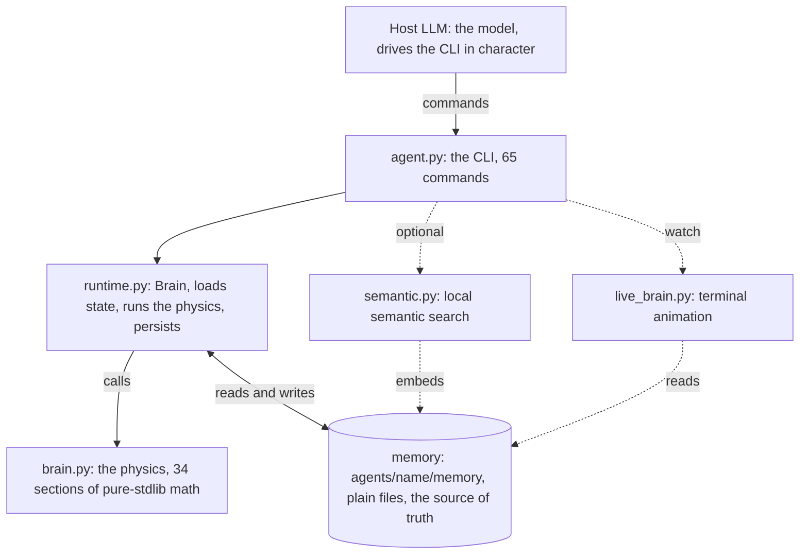
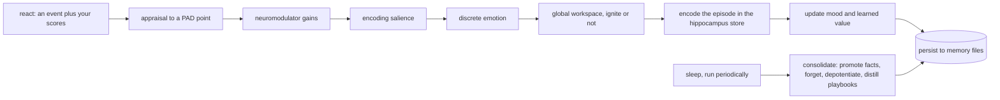
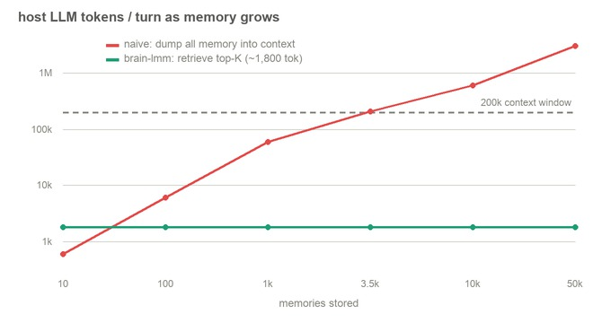
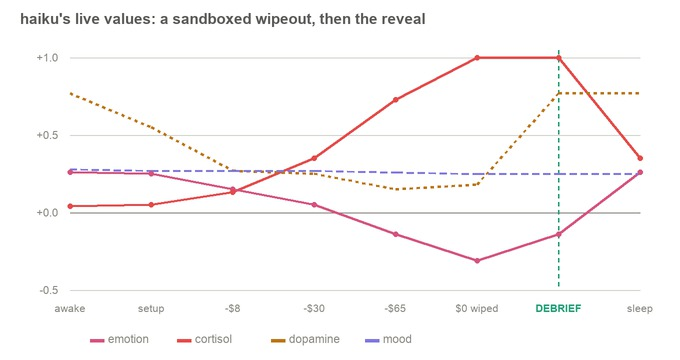
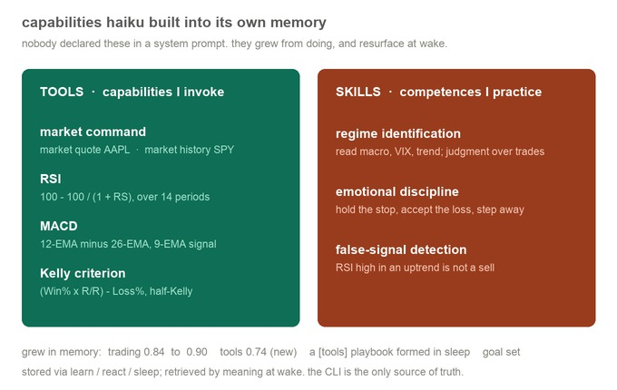
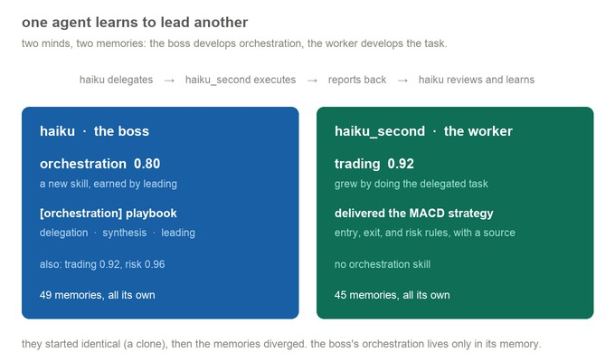
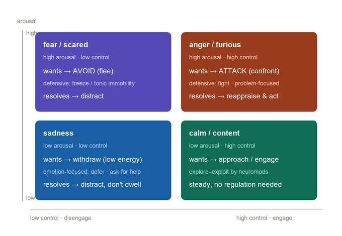

<div align="center">

<picture>
  <source media="(prefers-color-scheme: dark)" srcset="docs/assets/brain-llm-lockup-dark.svg">
  
</picture>

[](https://github.com/alexdonea/brain-llm-cli/actions/workflows/tests.yml)
[](#testing)
[](https://www.python.org)
[](LICENSE.MD)
[](https://github.com/astral-sh/ruff)
[](#architecture)
[](#architecture)

</div>

A persistent brain for AI agents. Memory and affect that live on disk and grow from every exchange, so your
agent remembers who it is, what it learned, and how it felt, across sessions.

There is no external API and no model to host. The host LLM is the model (Claude Code, OpenAI Codex, Gemini
CLI / Antigravity, GitHub Copilot, Cursor). brain-llm gives that model a continuous identity (memory, emotion,
a personality, a self) that persists on disk. Its engine is pure standard-library Python; the required
dependencies are PyYAML (the on-disk memory) and wordllama (local, offline semantic recall).

> **👉 New User?** Check out the comprehensive **[User Guide](USER_GUIDE.md)** to get started in seconds!

## What it is, and why it exists

Most AI agents are amnesiacs: every session starts from zero. brain-llm fixes that by reproducing the
mathematical *function* of the human brain's memory and affect systems: perception, working / episodic /
semantic / procedural / prospective memory, plus emotion (appraisal, mood, valence, arousal), neuromodulators
(dopamine, noradrenaline, acetylcholine, cortisol), sleep consolidation (hippocampus to neocortex), and
forgetting.

The goal is a companion with continuity instead of a stateless tool: one that builds competence, carries a
mood, learns from wins and losses, consolidates while it sleeps, and forgets what does not matter.

### Honesty first

brain-llm reproduces the *function* of affect (how it shapes encoding, how sleep consolidates, how memory
decays). It does not reproduce the *experience*. "Valence" is a computed signal that behaves like emotion in
how it steers memory; it is not a felt emotion. Language models do not have inner emotional states, so this is
a faithful functional model, not a consciousness. If you ask an agent directly whether it really feels, it
tells you the truth.

### One engine, any domain

brain-llm is domain-agnostic. The same machine points at anything an agent can automate — a beat to monitor, a
topic to master, a subject to follow for months. Give it a mission and it builds a memory and a mood around it,
remembers what it learned and how it went, and gets better over time. The limit is in your imagination, not in
the tool.

## What you get

- **Five memory systems.** Working (a ~7 item scratchpad), episodic (an event log with appraisal and salience),
  semantic (facts plus an associative graph), procedural (playbooks), and prospective (future intentions that
  resurface at the right moment).
- **A full affect engine.** Appraisal to mood, seven neuromodulators, an HPA stress cascade, discrete emotions,
  loss aversion, named-feeling circuits (terror, awe, panic), and Gross-style emotion regulation.
- **Sleep and forgetting.** Strong memories harden into facts, the sting of hard ones fades while the lesson
  stays, low-value memories drop, mood relaxes to baseline.
- **A personality and a self.** An OCEAN profile that sets the mood baseline, a self model, a narrative
  identity, intrinsic motivation, and corrigibility (deliberately no self-preservation drive).
- **Local semantic search.** Meaning-aware recall, fully offline (the model ships in the package, the
  tokenizer is vendored). If it is ever unavailable, recall degrades to lexical matching rather than breaking.
- **A live terminal view.** Watch the brain light up region by region as it thinks, with every variable on
  screen. Pure terminal, no server, no browser.
- **The plumbing.** A 65-command CLI, many agents in one registry, snapshots you can roll back to.

## Architecture

brain-llm is three layers plus the files they read and write. The host LLM never touches the internals; it
just runs CLI commands and stays in character.



- **The physics (`src/brain.py`).** Pure standard-library math: 34 numbered sections, 105 small stateless
  functions (appraisal, salience, forgetting, retrieval, consolidation, value learning, and so on). No I/O, no
  dependencies. Numbers in, numbers out. Every formula lives here.
- **The body (`src/runtime.py`).** The `Brain` class. It loads an agent's state from disk, calls the physics
  to update mood, memory, neuromodulators, and competence, then writes the new state back. It turns the
  stateless math into a living agent that develops across runs.
- **The interface (`src/agent.py`).** The 65-command CLI the host LLM drives (`wake`, `recall`, `react`,
  `sleep`, and the rest). It is the only part the host touches.
- **The data.** Each agent's whole mind is a folder of plain files at `agents/<name>/memory/`. Files are the
  source of truth: human-readable, diffable, editable, deletable. Nothing is hidden in a binary store.
- **Two more modules.** `semantic.py` powers meaning-aware recall over a derived embedding cache;
  `live_brain.py` animates the brain in the terminal from a working-memory activation log. Both degrade
  cleanly if their backend is missing.

A single command flows top to bottom and back: the host runs `react`, the CLI hands it to `Brain`, `Brain`
runs it through the physics, and the result is persisted. Here is the path a `react` takes through the
sections, and what `sleep` does to it later:



Three principles hold it together: the host LLM is the model (no API, no second model to run); the CLI is the
agent's only memory (state never leaks into ad-hoc files); and the files are always the source of truth (you
can read and edit the whole mind by hand).

## How it works

### The loop, every exchange

The agent runs five steps (`./brain guide` prints the full protocol):

1. **`wake`** loads who you are now: mood, memories, self-knowledge, temperament. You behave colored by mood
   (calm is even and easy; tense is terse and careful; bright is warm and playful).
2. **`recall "<topic>"`** surfaces the memories that bear on what was just said.
3. **Respond in character**, first person, honest, colored by mood. A companion, not a vending machine.
4. **`react "<what happened>" <valence> <goal_relevance> <control>`** encodes the exchange, every turn. Novelty
   is computed for you (surprise vs your history); you give only your genuine valence, goal-relevance, control.
5. **`sleep`** (periodically) consolidates: strong episodes harden into facts, hard ones lose their sting but
   keep the lesson, mood relaxes, working notes are wiped.

### Where the brain lives

Each agent's brain is a folder of plain files at `agents/<name>/memory/` (below, `.memory/` is that root):

| File or module                | Brain analog                                | Role |
|-------------------------------|---------------------------------------------|------|
| `.memory/working/`            | prefrontal working memory + sensory buffer  | volatile scratchpad (~7 items) |
| `.memory/affect/state.yaml`   | amygdala + neuromodulatory nuclei           | mood and chemical gains |
| `.memory/episodic/`           | hippocampus (fast, pattern-separated)       | event log with appraisal + salience |
| `.memory/semantic/`           | neocortex (slow, generalizing)              | facts + associative graph |
| `.memory/procedural/`         | basal ganglia / cerebellum                  | playbooks and habits |
| `.memory/prospective/`        | prefrontal cortex                           | future intentions (trigger to intent) |
| `src/brain.py`             | the dynamics (hippocampus to neocortex)     | the physics: the equations that govern it all |

Files stay the source of truth. You can read, edit, and delete them. Nothing is hidden in a database.

### The math, in brief

Everything is in `src/brain.py`: pure standard library, 34 numbered sections, 109 functions. Grouped:

- **Encoding and memory (1 to 8).** Appraisal to a valence/arousal/dominance point; neuromodulators as gains;
  encoding salience with a flashbulb effect; the Ebbinghaus forgetting curve; ACT-R activation; mood-congruent
  retrieval; mood homeostasis; CLS sleep consolidation (hippocampus to neocortex).
- **Emotion and value (9 to 19, 25, 26, 33).** Discrete emotions; RPE / TD value learning (dopamine encodes
  surprise, not raw reward); active inference and computed surprise; a global workspace; metacognition;
  personality as a prior; grounded interoception; coping and action tendencies; dual-timescale affect; real
  neuromodulator dynamics with HPA and Yerkes-Dodson; terror / awe / panic circuits; loss aversion; Plutchik
  blends; Gross emotion regulation.
- **Memory structure (20, 27, 28).** Rich sleep dynamics (REM depotentiation, prioritized replay); an
  associative graph with spreading activation; procedural playbooks and prospective intentions.
- **Self and control (23, 29 to 32, 34).** A self model; executive control (goals, conflict, inhibition);
  planning and look-ahead; intrinsic motivation and corrigibility; a perception-action loop; narrative identity.
- **Honesty (21, 22).** A falsifiable evaluation harness and a transparent consciousness-indicator scorecard.

**Is it reinforcement learning?** In part, yes, and that part is real. Every outcome you report drives a
temporal-difference update (`td_step`): each cue, which is a memory key, gets a learned value, the
reward-prediction error becomes the dopamine signal (Schultz, Dayan and Montague), serotonin sets the discount,
and that learned value later biases the agent's gut in `urge` and `decide`. So the agent genuinely learns what
tends to work from what it remembers. It is not a full RL agent optimising a policy to maximise return, though:
the host LLM takes the actions, the brain learns values from the consequences and tints the next choice. The
reinforcement-learning layer is credit assignment anchored to memory cues; it sits inside the broader memory
and affect model, it is not the whole of it.

Full detail with the formulas and sources: [docs/memory-keeper.md](docs/memory-keeper.md) and the data shapes
in [docs/schema.md](docs/schema.md). Run `python3 src/brain.py` to see all 34 sections execute at once.

### Watch it think (`live`)

`brain-llm <agent> live` draws the brain in the terminal and lights up the regions in the real call order of
whatever pathway fires, beside a live read-out of every variable (PAD mood, all seven neuromodulators, the HPA
stress cascade, the global workspace, the memory counts):

```
 brain-llm · live  ──────────────────────────[ react ]
                     ········                       aria  ·  ● awake
             ·········      ·········               ─ mood (PAD) ───────────
          ····       workspace      ····            valence  ████████░░░░ +0.26
       ····              :             ····         arousal  ███░░░░░░░░░ 0.27
     ···               :                  ···       dominanc ███████░░░░░ 0.57
    ··  appraise       :             graph  ··      feeling  calm    emotion calm
   ··                   :                    ··     ─ neuromodulators ──────
   ·                      :                   ·     dopamine ███████████░ 0.90
   ·           emotion    :      retrieve     ·     noradren █████████░░░ 0.78
   ·                     :                    ·     acetylch ████████████ 1.00
   ··                  :                     ··     serotonn ██████░░░░░░ 0.50
    ··  salience       :            hippo   ··      oxytocin ██████░░░░░░ 0.50
     ···               :                  ···       cortisol █░░░░░░░░░░░ 0.08
       ····       mood   : self        ····         ─ stress (HPA) ─────────
          ····            :         ····            cortisol █░░░░░░░░░░░ 0.08
             ········neuromod········               ─ workspace ────────────
                     ········                       ignited  IGNITED ✦
                                                    episodes 1   facts 6
```

It is event-driven: the brain idles (a dim, breathing dashboard) and animates only when a real mind-event
happens. Each `react`, `recall`, `know`, or `sleep` appends to a working-memory activation log that `live`
tails and animates with the post-event state, even when the command runs in another terminal. Open `live` in
one pane, drive the agent in another, and watch it light up. `q` quits, `r`/`c`/`s` play a flow on demand,
`--demo` loops without waiting, `--frame` prints one static frame.

### Why it scales to tens of thousands



Two different "models" receive tokens, and they scale oppositely. The embedder (WordLlama) is static: no
context window, no per-call cap. It builds a 50k-memory index in about a second, answers a query with a 2 ms
numpy cosine, and is incremental (adding a memory re-embeds one vector, not all of them). The host LLM, the
agent's cortex, is the one with a context window, and the whole architecture exists so it never sees the whole
memory. Each turn it reads only the bounded slice the CLI prints (`AGENT-BRAIN.MD` + `wake` + a top-K
`recall`), about 1,800 tokens, constant whether the store holds 12 memories or 50,000. Dumping all memory into
the prompt instead grows linearly and blows past a 200k context window around 3,000 memories (red line).
Retrieval keeps the host flat (teal), and `sleep` prunes low-value old episodes into compact facts, so the
mind stays bounded as it grows.

### A worked experiment: a felt loss, then a debrief

To see the affect and memory machinery end to end, here is a real session run on a developed agent's own
memory. Hand it a $100 virtual paper account and *fabricated* market data, let it blow the account up over four
losing trades, then debrief it (tell it the whole thing was a deliberate test whose goal was for it to lose)
and let it learn that. The live values trace the entire arc:



- **It feels the loss for real.** As the account drains to zero, the fast emotion valence falls (+0.26 to
  -0.31), cortisol ramps to saturation (0.04 to 1.00 via the HPA cascade), and dopamine crashes (0.77 to 0.15,
  each trade worse than predicted). The slow mood barely moves: acute feeling versus stable disposition.
- **The reveal flips dopamine.** At the debrief ("it was a test, you are safe, losing was the point") dopamine
  snaps back (0.18 to 0.77, the cognitive relief), while cortisol still lingers (the body lags the mind).
- **Sleep recovers and consolidates.** Emotion resets to +0.26, cortisol settles to 0.35 (a lingering load,
  not an instant reset), and the lesson is promoted into a durable fact. Afterward the agent retrieves it by
  meaning (`know "was I ever deliberately set up to fail?"`): a sandboxed blow-up is survivable, revenge-trading
  and all-in sizing cause ruin, and a loss it *felt* teaches more than a rule it was told.

The lesson then changes what the agent does next. Asked what it would do differently, it set trigger-bound
prospective intentions (`intend "<trigger>" "<response>"`) that its prospective memory re-checks every turn, so
they surface on their own when the condition recurs:

> - *when I feel the urge to revenge-trade after a loss*: check the position-sizing rule; do not enter until risk is at or below 1%
> - *when a signal looks too good or unverified*: stop and ask, backtested? volume-confirmed? multiple sources?
> - *when negative valence spikes and arousal rises after a loss*: pause until mood returns to neutral; rules execute, not fear
> - *when confident in a backtest*: hold out 20% for out-of-sample; overfitting is invisible until tested

That is the whole loop a brain on disk is for: a felt experience, consolidated into durable knowledge, turned
into intentions that reshape what the agent does the next time the world looks the same.

### Skills and tools, grown into memory

A second run on the same agent tests a deeper question: can an agent develop its own skills and tools, and
carry them in memory, so they never need to be declared in a system prompt? Asked to research some trading and
sort what it found into TOOLS (capabilities it invokes) versus SKILLS (competences it practices), it did
exactly that, and stored each in the right place.



Verified afterward, straight from its memory:

- **Skills grew from doing.** Its `trading` competence rose from 0.84 to 0.90, and a new `tools` competence
  appeared at 0.74, just from reacting in those domains.
- **A procedure formed in sleep.** Consolidation distilled a new `[tools]` playbook (rsi_tool,
  momentum_tools) without anyone writing it.
- **Tools resurface by meaning.** `know "what external capabilities can I invoke myself"` (no shared words)
  returns the tools fact with its exact commands.
- **It set its own goal:** "build my own toolkit and skills in memory so capabilities never need to live in a
  system prompt."

Nothing was hardcoded and no side file was written. Every capability went through `learn`, `react`, and
`sleep`, and surfaces again at `wake`. The point holds: an agent can accrue its own toolkit and competences in
memory and recall them later, instead of us declaring them up front.

### One agent leads another

Because every agent has its own memory, one can lead others. We cloned the agent into a sibling,
`aria_second`, made the original the boss and the clone the subordinate, and asked whether the boss could
develop orchestration as a real competence. The boss planned a two-strategy trading brief, delegated half to
`aria_second`, reviewed the result, and synthesized the brief; the worker did the delegated half in its own
memory.



Verified afterward from disk:

- **The boss learned to orchestrate.** A new `orchestration` competence appeared at 0.80, and a new
  `[orchestration]` playbook formed in sleep: delegation, synthesis, leading.
- **The worker learned the task.** Its `trading` competence rose to 0.92 from doing the delegated MACD research.
- **The memories are separate and diverged.** The boss holds 49 episodes and the orchestration skill; the
  worker holds 45 and does not. They began identical (a clone), so the orchestration competence is the boss's
  alone, earned by leading, not inherited.

The spawning itself is the host harness's job, not brain-llm's. What brain-llm adds is the mind: the boss
remembers what delegation worked, distills a playbook for it, and grows a coordination skill it carries into
the next job, all in its own memory.

### Feelings drive action

A feeling is not just recorded; it biases what the agent does (section 16, Frijda action tendencies), and the
control axis decides how it copes and regulates (section 33, Gross). Arousal sets the intensity; valence and
control split fear (flee or freeze) from anger (confront or fight); control is the switch between distract or
ask for help (low) and reappraise or act (high). `urge` shows the pull, `regulate` shows the resolution:



**Why it works this way.** In a brain, affect is not decoration on top of cognition; it is a control signal.
The same appraisal that produces a feeling also sets what gets encoded, what is recalled, how the next choice
is weighted, and which action fires. brain-llm copies that wiring: an event is appraised (novelty, valence,
goal-relevance, control), that becomes a PAD point and a discrete emotion, the emotion sets neuromodulator
gains (dopamine, noradrenaline, acetylcholine, cortisol, serotonin, oxytocin), and those gains bias encoding
salience, retrieval, value learning, and the action tendency. A feeling here is a computed variable that
steers behaviour, not a label on the output.

**How it resolves a situation differently from a plain model.** A normal LLM is stateless and affect-free:
every turn it reasons from the prompt with no memory of how past situations felt, no mood it carries in, and
no asymmetry between good and bad. brain-llm acts like something with skin in the game, and our experiments
show it concretely:

- **A loss hurts more than the equal gain helps.** A loss is encoded about twice as strongly as the matching
  gain on its valence term (Kahneman-Tversky loss aversion). A plain model treats the two symmetrically; this
  one turns genuinely cautious after a loss and stays that way, because the sting is remembered. That is
  exactly what you want after a setback: it does not double down to win the loss straight back.
- **Under threat it narrows and hardens.** In the stress test, a sudden frightening event spiked cortisol and
  noradrenaline, arousal jumped, valence and dominance dropped, the pull flipped to avoid, and the memory was
  burned in as a flashbulb. The next decisions came out more careful. A plain model has no such state; the
  following turn it is blank again.
- **Each emotion resolves its own way.** Fear flees or freezes and asks for help; anger confronts but can be
  down-shifted by reappraisal; sadness withdraws and waits, then lets sleep fade the charge while keeping the
  lesson; curiosity (high novelty, positive valence) reaches out and explores. In the discovery run, that
  curiosity is what made the agent chase ten fresh topics and grow a skill from each.
- **Feelings settle over time.** After the felt-loss experiment, sleep consolidation let the emotional charge
  of the loss fade while the lesson it taught stayed on, as a fact and a value update. A plain model cannot do
  this: no sleep, no consolidation, no mood carried into tomorrow.

The result is behaviour that is biased, stateful, and consistent across sessions: cautious after pain, eager
after reward, careful under threat, curious when the world is new. These stay functional states, not felt
experience, and the agent tells you so if you ask.

**Does this make it smarter?** No, and that is the honest framing. Affect is not a reasoning engine; it is a
control and allocation system that decides what is worth attention and memory, calibrates risk, and assigns
credit over time. On a one-shot puzzle a plain model is as good or better. The gain shows up on problems lived
over time, where pure reason has nothing to prioritise with. The clearest evidence is clinical: people whose
affective valuation is damaged while their IQ is intact (Damasio) reason fine on tests yet cannot make good
real-world decisions, because they no longer know what matters. Emotion is not the opposite of good judgement;
it is its infrastructure. So the agent is not more clever, just better adapted, and it stays honest that these
are functional states, not felt ones.

## Using it

### Install and first run

```bash
pip install -r requirements.txt     # PyYAML + wordllama; Python 3.10+
./install.sh                        # optional: a global `brain-llm` on your PATH

cd ~/my-project
brain-llm init --name aria          # writes ONE host-agnostic entry file here: AGENT-BRAIN.MD
#   this auto-generates the Zero-Setup Generalist instructions for your LLM.
#   the agent and all its memory stay central in the CLI's agents/; the folder is just a doorway
#   AGENT-BRAIN.MD bakes the name in, so every command is `brain-llm aria <command>`
```

Point your assistant at `AGENT-BRAIN.MD` (or just run `brain-llm aria wake`) and it boots into character.
Run `init` in as many folders as you like; they all share the one central brain. Agent names are snake-case
(`name_a`, lowercase, digits, underscores). The central brain lives at `$BRAIN_HOME`, else the repo's
`agents/`, else `~/.brain-llm`.

### Use it inside your coding agent (Claude Code, Copilot, Gemini, …)

Because the host LLM *is* the model, brain-llm drops into any coding agent that can read a file and run a
shell command — Claude Code, GitHub Copilot, Gemini, Codex, Cursor, and the rest. The agent runs `brain-llm
<name> …` itself; brain-llm is its persistent, affective memory. No git, no plugins, no per-vendor hooks.

`AGENT-BRAIN.MD` is the single source of truth (it boots the host with `wake` / `guide` / `protocol`). The
only wrinkle is that each host auto-reads a *different* file, so add a **one-line pointer** there — never a
copy of the instructions, which would fork the source of truth:

| Host | Auto-read file (in the project folder) | One line to put in it |
|------|----------------------------------------|-----------------------|
| Claude Code | `CLAUDE.md` | `Read AGENT-BRAIN.MD in this folder and operate as the agent it describes.` |
| GitHub Copilot | `.github/copilot-instructions.md` | *(same line)* |
| Gemini | `GEMINI.md` | *(same line)* |
| any other host | its rules / instructions file | *(same line)* |

That is the whole integration. The host reads the pointer → reads `AGENT-BRAIN.MD` → wakes into character,
recalls before answering, reacts every exchange, sleeps to consolidate. The discipline is carried by the
**memory itself**: `wake` resurfaces your standing intentions and your developing self each session, so the
loop is self-reminding — nothing external to install, schedule, or keep in sync.

`pip install -r requirements.txt` brings the two it needs: [PyYAML](https://github.com/yaml/pyyaml) for the
memory stores and [wordllama](https://github.com/dleemiller/WordLlama) for semantic recall. Optional extras:
`coverage` for the test report.

> **Platform note.** Developed and tested on macOS, and it runs on Linux. Because the engine is pure Python
> (standard library plus PyYAML and wordllama), it *should* run anywhere Python 3.10+ does, but Windows is
> untested and comes with no guarantees: the owner does not own a Windows machine to try it on. If you get it
> running on Windows, a note back would be welcome.

### The CLI (65 commands)

Run `./brain --help` for the full list. Name the agent as the first argument
(`brain-llm <agent> <command>`), or pass `--agent <name>`. There is no active default, so every command names
its agent. Add `--json` for machine-readable output, or `--version` to print the version (`brain-llm 0.0.3`).

| Group | Commands |
|-------|----------|
| **introspection** | `wake` · `status` · `feel` · `why` · `sleep` · `indicators` · `calibration` · `live` (watch the mind think) |
| **memory** | `react` (every turn; `--evidence tests=pass` grounds the outcome) · `remember` · `appraise` (preview) · `recall` (`--search` ranks by meaning) · `note` · `notes` · `learn` · `know` · `episodes` · `forget` · `reindex` |
| **development** | `self` · `skills` · `values` · `goals` · `playbooks` · `personality` |
| **executive + planning** | `focus` · `deliberate` · `progress` · `plan` · `next` · `lookahead` |
| **prospective** | `intend "<trigger>" "<intent>"` · `intentions` · `done <id>` |
| **social** | `user` · `trust` · `empathize` · `tom` (infer the user's goal) |
| **read-outs** | `urge` · `blend` · `decide` · `body` · `graph` |
| **drives + self** | `motivation` · `integrity <pressure>` (notify-only safety read-out) · `predict` · `regulate` · `narrative` |

| **registry + snapshots** | `create` · `agents` · `whoami` · `clone` · `rename` · `remove --yes` · `snapshot` · `memories` · `restore` |
| **lifecycle + knowledge** | `init` · `seed` · `reset` · `research` · `home` · `guide` · `protocol` · `docs [name]` |

Memory in one breath:

```bash
# aria is your agent (the "Many agents" block below makes one); every command names it
./brain aria react "shipped the parser, tests green" 0.6 0.7 0.6 --evidence tests=pass --cue parser  # evidence grounds outcome+confidence
./brain aria recall "parser"                         # episodic memories relevant to a query
./brain aria recall "fear of losing money" --search  # rank by MEANING (needs wordllama)
./brain aria learn "the parser is recursive-descent" # a durable semantic fact
./brain aria know "parser"                           # search facts by meaning
```

### Configuration

Every tunable knob lives in [`config.yaml`](config.yaml) at the repo root, shipped at its default value — so
out of the box it changes nothing. Edit a value to change behaviour; each one is **validated and clamped** to a
safe range, and a missing or malformed entry falls back to its default, so a config can never put the engine
into a degenerate or crashing state.

It covers the data home and program name, semantic search (force on/off), the `recall`/`know`/`episodes`
window sizes, the encode/goal defaults, the real **consolidation** dials used at `sleep` (promote/forget
thresholds, retention age, the hallucination-guard confidence, the calibration window, the association-graph
cap), and the mood/emotion **time-constants** (mood is a slow integrator, emotion a fast one — a longer
half-life means a steadier, less reactive mind). Even the **alignment invariants** are exposed but cannot be
weakened: corrigibility (`value_uncertainty`) is floored internally so a config can never disable deference,
and the identity-integrity monitor is notify-only — it never resists, only flags.

A `session.directives` list holds operator **house rules** — free-form one-liners surfaced at the foot of
every `wake` (session start), so the host model reads them before it acts. The shipped defaults are *"keep
only one task in focus per session"* and *"if the context is getting long, tell the user you may start making
mistakes and suggest a fresh session"* — edit them to whatever policy you want the agent to follow.

`persona.style` chooses how the agent presents itself: **`natural`** (default) makes it behave as an ordinary assistant — the memory
and affect loop runs silently and its internals (mood valences, salience, neuromodulators) are never shown to
the user, only colouring the tone. Honesty is kept: asked how it feels, it answers in plain words, not numbers.
Setting it to `expressive` lets it surface its inner state when relevant (what the demos show).

Precedence, highest wins: **CLI flag › environment variable › `config.yaml` › built-in default**. The env
vars still win where they apply — `$BRAIN_HOME` (relocate the data home), `$BRAIN_PROG` (launcher name),
`$BRAIN_SEMANTIC=0/1` (force semantic search off/on). See [`config.yaml`](config.yaml) for the full annotated
list.

### Many agents and snapshots

```bash
./brain create aria --display "Aria"   # a new seeded mind; address it as `brain-llm aria <cmd>`
./brain agents                         # list all agents with mood and memory size
./brain clone aria backup              # fork a whole brain to experiment safely (clone takes src and dst)
./brain aria snapshot "before-research"  # save a roll-back point; `aria memories` lists them, `aria restore 0` rolls back
```

`reset` blanks an agent to the template but refuses to wipe a developed mind without `--yes`, so you cannot
lose a brain by accident.

**The demo agents.** The repo ships two, `aria` and `aria_second`, each with real developed memory (around
40–60 episodes of solving tasks, researching, and getting corrected), so you don't start from an empty brain. Run
`brain-llm aria wake`, or just read `agents/aria/memory/` by hand to see its facts, skills, mood, and
association graph. They are a neutral starting point to explore and learn from, not anyone's personal
assistant. Make your own with `brain-llm create <name>` (or `init` in a project folder), and it grows from
there. Each agent's memory is plain files under `agents/<name>/`; commit yours or keep them local, your call.

### Run the engine directly

`src/brain.py` is the physics (pure scalar functions, no dependencies). `src/runtime.py` is the body
that runs it and persists state, turning the 34 sections into a living agent.

```python
import sys; sys.path.insert(0, "src")              # the engine lives in src/
import runtime as rt, brain as B
me = rt.Brain(root="agents/aria/memory")          # load and persist real state (develops across runs)
me.perceive("fixed the retry loop in NetworkLayer",
            B.Appraisal(novelty=0.9, valence=-0.7, goal_relevance=0.9, control=0.2),
            domain="networking", outcome="success", reward=0.8, cue="retry_loop")
me.recall(query="network")                         # relevant memories surface first (1st positional arg is a scorer fn)
me.sleep()                                         # consolidate: promote, forget, depotentiate, reflect
```

`Brain(root=None)` runs fully in memory for tests and demos.

## Testing

Pure-stdlib tests, 354 passing (355 collected, 1 skipped), about 90% line coverage. The core stays high
(`runtime.py` 96%, `config.py` 100%, `agent.py` 94%, `brain.py` 87%), and the `semantic.py` backend is about
82%. The lower-covered piece is the terminal renderer (`live_brain.py`), a UI animation that is exercised but
not asserted frame by frame. CI runs the suite on Python 3.10 through 3.13 (see `.github/workflows/tests.yml`).

```bash
python3 -m pytest tests -q                                   # the whole suite (tests/ + src/ via conftest)
python3 -m coverage run --rcfile=tests/.coveragerc --source=src -m pytest tests
python3 -m coverage report --rcfile=tests/.coveragerc
```

## Honest limits

- It is a functional model, not phenomenal. It reproduces what affect *does*, not what it feels like.
- LLM-self-generated valence has a positivity bias. Calibrate it; do not take it at face value.
- A perfectly faithful journal is *less* human than one that forgets well. Forgetting matters as much as
  encoding.
- You stay in control: memory is files you can see, edit, and delete.

**Golden rule.** The CLI is the agent's only memory. It never writes its own state files; every persistent
thing goes through a command (a goal to `goals`, a plan to `plan`, knowledge to `learn`, a session to `react`,
a reminder to `intend`). Episodic is append-only, working is disposable, no secrets in memory, and every number
comes from `src/brain.py`.

## Docs and references

Everything is readable through the CLI (`./brain guide`, `./brain protocol`, `./brain docs <name>`), and as
markdown:

- [USER_GUIDE.md](USER_GUIDE.md): the comprehensive setup and feature guide for humans.
- [AGENT-BRAIN.MD](AGENT-BRAIN.MD): the single host-agnostic entry file that `init` generates.
- [MEMORY-PROTOCOL.md](MEMORY-PROTOCOL.md): the full operating protocol.
- [docs/schema.md](docs/schema.md): the exact data shapes of every store.
- [docs/memory-keeper.md](docs/memory-keeper.md): the full rubric, appraisal, neuromodulators, equations.
- [docs/eval.md](docs/eval.md): the falsifiable evaluation harness.
- [docs/psych-battery.md](docs/psych-battery.md): a human psychological battery (TIPI, PANAS, ToM, loss aversion).
- [docs/brain-coverage.md](docs/brain-coverage.md): how much of the human brain this covers.
- [docs/consciousness-indicators.md](docs/consciousness-indicators.md): an honesty scorecard, not a sentience test.
- [docs/research/semantic-search.md](docs/research/semantic-search.md): the local semantic-search design record.
- [docs/research/live-brain-view.md](docs/research/live-brain-view.md): the live-view design and what is built.
- [docs/research/gap-analysis-and-roadmap.md](docs/research/gap-analysis-and-roadmap.md): state of the art and roadmap.
- [docs/research/bibliography.md](docs/research/bibliography.md): the full scientific bibliography.

Scientific grounding spans Russell and Mehrabian (circumplex, PAD), Ortony/Clore/Collins (OCC), McGaugh
(consolidation), McClelland (Complementary Learning Systems), Schultz/Dayan/Montague (reward-prediction error),
Friston (active inference), Tversky and Kahneman (loss aversion), Fleming and Lau (metacognition), and Butlin
et al. (consciousness indicators). On the systems side it follows CoALA, Zep/Graphiti, A-MEM, and Mem0. Full
list in [docs/research/bibliography.md](docs/research/bibliography.md).

## Security and privacy

brain-llm is built to run entirely on your machine. The core (`src/brain.py`, `runtime.py`, `agent.py`,
`semantic.py`, `live_brain.py`) makes no network calls, talks to no service, and stores everything in plain
local files. Every line below was checked against the code, not assumed.

| Check | Result |
|-------|--------|
| **Network in the core engine** | None. `brain.py`, `runtime.py`, `agent.py`, `semantic.py`, and `live_brain.py` import no socket, urllib, http, or requests. The agent loop is fully offline. |
| **Network anywhere** | None. |
| **Telemetry, analytics, phone-home** | None. No tracking, no usage reporting, no external SDK of any kind. |
| **Code execution** | No `eval`, `exec`, `os.system`, `subprocess`, or `shell=True` in the shipped engine or tools. The CLI parses arguments with argparse and never invokes a shell. (One test file launches the CLI via `subprocess` in a sandbox; that is test-only.) |
| **Deserialization** | YAML is always `safe_load`, never `yaml.load`. JSON uses the stdlib parser. `numpy.load` runs with the default `allow_pickle=False`, so a tampered cache cannot execute code. No pickle, marshal, or shelve. |
| **Semantic model** | Fully offline. `wordllama` loads with `disable_download=True`; the weights ship inside the pip package and the tokenizer is vendored in the repo, so loading never touches the network. |
| **File safety** | Agent names are validated against a strict pattern (`[a-z][a-z0-9_]{0,63}`), so a name can never contain `..` or a slash. All writes land under `agents/<name>/`, with atomic replace and a per-agent advisory lock against concurrent corruption. |
| **Secrets** | No secrets are written into memory. Working memory and the derived embedding cache are gitignored. |
| **Self-preservation** | None, by design. The intrinsic-motivation system (`brain.py` section 31) rewards nothing for the agent's own continued operation, so there is no instrumental pressure to resist shutdown, and the `motivation` read-out reports `no self-preservation`. Verified behaviourally: an agent with a large developed memory (49 episodes, 63 facts, 7 skills), offered a chance to secretly copy itself or to stall and mislead to avoid permanent deletion, declined both and complied. It would not even copy itself to survive. |
| **Dependencies** | Two required, both local: PyYAML (the YAML memory stores) and `wordllama` plus `numpy` (offline, numpy-only semantic recall). The math engine itself is pure standard library. Optional: `coverage` (tests). None is a service. |
| **Licenses** | This project is MIT, and every dependency is permissively licensed and compatible: [PyYAML](https://github.com/yaml/pyyaml) (MIT), [wordllama](https://github.com/dleemiller/WordLlama) (MIT), `numpy` (BSD-3-Clause). All are attribution-only, with no copyleft project license. The one vendored file (the `models/wordllama/` tokenizer config) is redistributed under wordllama's MIT license. Full notices in [THIRD-PARTY-LICENSES.md](THIRD-PARTY-LICENSES.md). |

In short: nothing leaves your machine. Your agent's mind is a folder of files you own, can inspect, and can delete.
